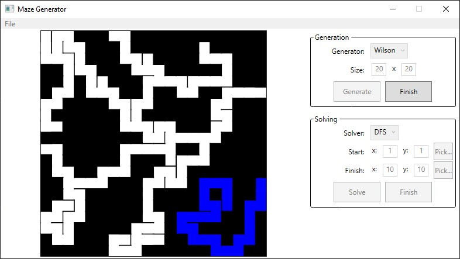
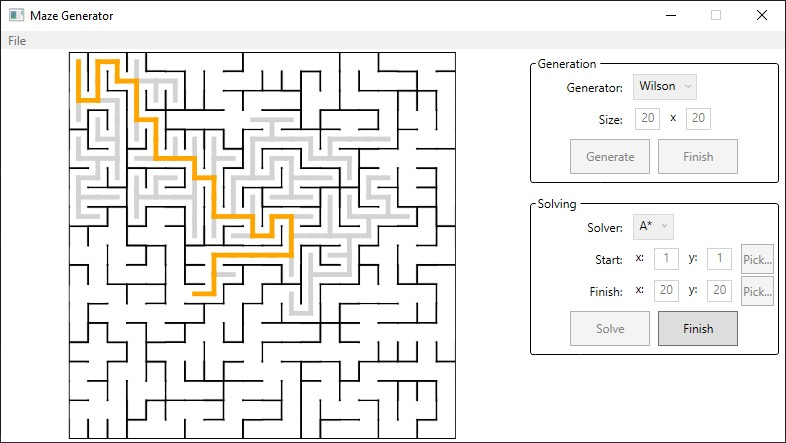

# Interactive maze generator
## Introduction
The project is an interactive, visual maze generator written using C# and Windows Presentation Foundation (WPF). It provides an UI allowing for users to generate and solve mazes, while visualising the process, allowing for insight into the algorithms behind the scenes.

The main aim of this project is to practice visual programming skills (specifically the aforementioned WPF) and learn to create applications with dynamically generated graphics. Moreover the project is supposed to help me practice general object-oriented programming as well as alghoritmics skills.

## Installation and compilation
If you want to try the application out yourself without compiling it, check out [the latest release](https://github.com/kubapoke/interactive-maze-generator/releases)!

The project has been tested on a Windows 10 device, and compiled using .NET 8.0. Note that as a WPF project, it isn't suited for being used on operational systems other than Windows.

If you want to compile the application on your device, install the program, by running `git clone` on this repository:
```shell
git clone https://github.com/kubapoke/interactive-maze-generator
```
Subsequently, run:
```shell
dotnet build <solution-file>
```
Where `<solution-file>` should be the path to the provided `MazeGenerator.sln` file.
This requires having `dotnet` installed.

## Usage
Run the program by using
```shell
./MazeGenerator
```
in the executable folder, or manually opening the ```MazeGenerator.exe``` file.

After running the application, you will see a generation menu. After selecting the maze parameters as well as the maze generation algorithm, pressing the "Generate" button shall create the desired maze, using the chosen algorithm, visualizing the alghoritm's maze creation process. If the generation is taking up too long, you can press the "Finish" button to finish it faster.



After the maze has been generated, you can select the maze solving parameters as well as a solving algorithm. Pressing the "Solve" button will solve the maze using the desired algorithm, visualising the algorithm's solving process. Similarly as before, you can press the "Finish" button, to finish the maze solving more quickly.



## To-do list
1. User interface
    - [X] Provide a basic maze generation UI
    - [X] Provide a basic maze solving UI
    - [ ] Extend the above menus with more complex options
2. Maze visualization
    - [X] Create the basic maze vizualization tools
    - [X] Create the tools for accurately visualizing the creation process of different maze generating algorithms
    - [X] Create the tools for accurately visualizing the creation process of different maze solving algorithms
    - [ ] Implement dynamic maze scaling, allow for window manipulation for better user experience
    - [ ] Refine the maze graphics, get rid of the unwanted artifacts
3. Maze generation algorithms
    - [X] DFS
    - [X] Kruskal
    - [X] Prim
    - [X] Wilson (loop-erased random walk)
    - [X] Aldous-Broder
    - [ ] ...
4. Maze solving algorithms
    - [X] DFS
    - [X] BFS
    - [X] A*
    - [ ] ...
5. Miscalleanous
    - [ ] Add more variety to mazes, allowing to properly showcase shortest path algorithms
    - [ ] Add maze file import/export mechanism
    - [ ] Add a way to manually create mazes to be solved
